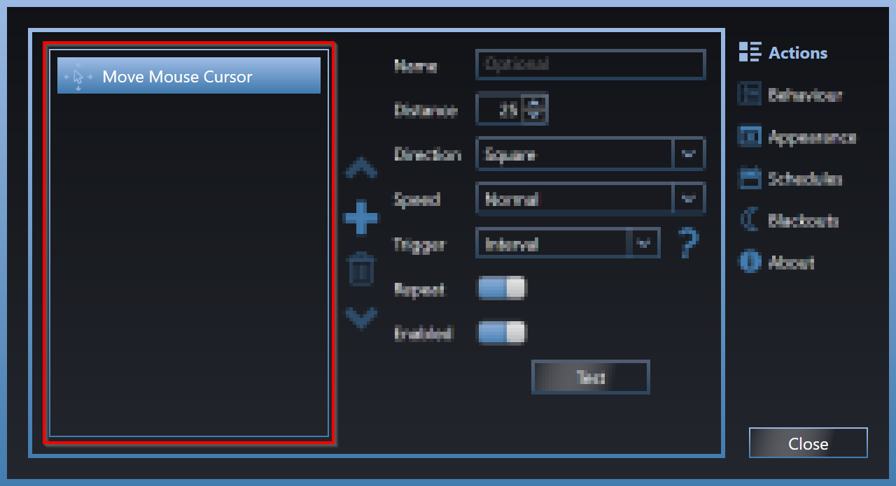
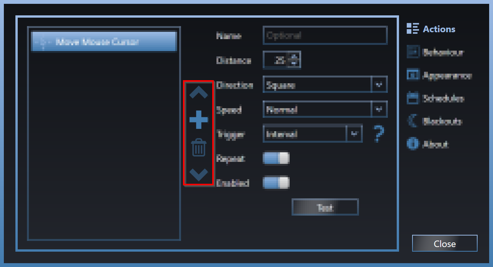
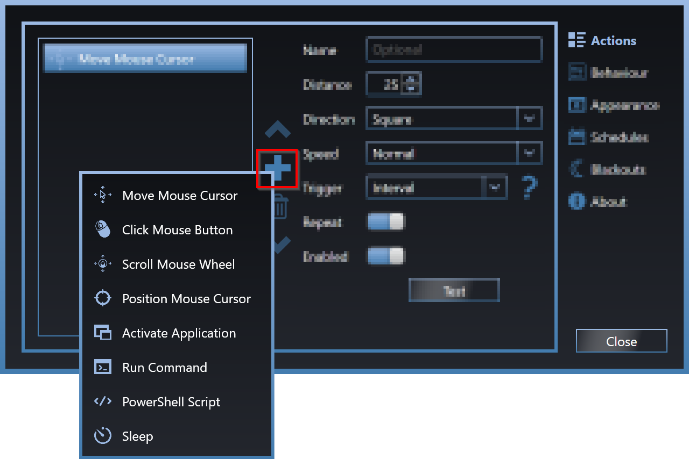
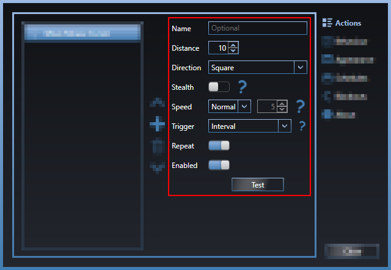

# Introduction
Move Mouse is a simple piece of software that is designed to simulate user activity.

Originally designed to prevent Windows from locking the user session or going to sleep, Move Mouse can be deployed in a wide range of situations.
# Donate
Move Mouse will always be free, but if you would like to buy me a beer to show your appreciation, you can do so using the following link. Thanks!

https://www.paypal.com/cgi-bin/webscr?cmd=_s-xclick&hosted_button_id=QZTWHD9CRW5XN
# Installation
## Microsoft Store
The easiest way to install Move Mouse on Windows 10 or 11 is from the Microsoft Store using the link below.

https://www.microsoft.com/en-gb/p/move-mouse/9nq4ql59xlbf
### Pros
- Simple installation.
- Automatic updates.
### Cons
- Microsoft Store not normally available on work/corporate machines.
- CLI options unavailable.

## GitHub
Move Mouse may be open source, but you do not need to be a developer, or compile source code to use the GitHub version.

1. Vist the [Releases](https://github.com/sw3103/movemouse/releases/) page and locate the latest version.
2. Under the Assets section you will see three available downloads. Download the "move-mouse-x.x.x.zip" file, which contains a single "Move Mouse.exe" file.
3. Before you extract the ZIP file, you may wish to [Unblock](https://www.thewindowsclub.com/fix-windows-blocked-access-file) it to prevent the annoying security warnings.
4. Extract the ZIP file to your chosen location and run "Move Mouse.exe".
### Pros
- Custom installation path.
- CLI options.
- Portable (better option for work/corporate machines).
### Cons
- Manual updates.
# User Guide
## Getting Started
By default, Move Mouse is configured to move your mouse cursor every 30 seconds.

You can start this by clicking Move Mouse, at which point you will see the outer ring turn green, and the 30 second countdown begins.

Once the countdown is complete, Move Mouse will perform the specified Actions (in this case, moving the mouse cursor).

Move Mouse will continue to repeat these Actions, unless you stop them by clicking once again.

You can also start/stop Move Mouse by double-clicking the system tray icon.

## Hover Buttons
You will quickly notice that Move Mouse will present you with some options when you hover your mouse cursor.

### Gear
Opens the Settings section where you can access the many different options to help you customise Move Mouse for your requirements.

### Envelope
Send feedback email to me.

### Question Mark
Brings you to this help site.

### Twitter
Takes you to Move Mouse's Twitter page.

### Cross
Closes Move Mouse.
## Status Colours
The outer ring on Move Mouse will change colour to reflect the current status.
### Idle (Blue)
Move Mouse is doing nothing, and will continue to do so until it is started from the main window, the system tray icon, or you have set a start Schedule.

### Running (Green)
Move Mouse is active and counting down towards performing your Actions.

### Executing (Red)
Move Mouse is performing your Actions.

### Paused (Yellow)
Move Mouse has automatically paused because it has detected user activity (this option needs to be enabled in Behaviour).

### Sleeping (Purple)
Move Mouse is asleep because there is an active Blackout window in operation.

## Settings
Access the Settings by clicking the Gear icon on the hover button or system tray icon, or right-click the main Move Mouse window.
### Actions
This is where things get interesting. Move Mouse can perform a wide range of Actions, which can be customised to fit your exact requirements.
#### Overview
##### Action List
Here you will see the list of Actions, which by default will start with a Move Mouse Cursor Action.

##### Action Controls
Use the Action Controls to add, remove and re-order your Actions.

###### Add
To add an Action, click the plus icon in the Action Controls, and select the desired Action from the list.

###### Remove
Select an Action, and click the bin icon.

###### Re-ordering
Select an Action, and use the arrow icons to re-order them in the list.

##### Action Properties
Each Action contains its own set of Properties that can be used to customise its behaviour. Some of these Properties are specific to the type of Action, for example, the Distance Property on the Move Mouse Cursor Action. There are also Common Action Properties which apply to all Actions.

##### Common Action Properties
###### Name
Used to give your Action a meaningful name, which will change how it is displayed in the Action List.
###### Trigger
Lets Move Mouse know when you would like to perform the Action.
- **Start** - Perform the Action only when Move Mouse starts, whether this be from clicking Move Mouse, resuming from being paused, or a Scheduled start. This does not include leaving a Blackout window.
- **Interval** - Perform the Action at each interval, which is when the Move Mouse countdown has reached zero.
- **Stop** - Perform the Action when Move Mouse stops, including clicking Move Mouse, entering a paused state, or a Scheduled stop. This does not include entering a Blackout window.
###### Repeat
Only available when the Trigger is set to Interval, this option lets Move Mouse whether the Action should be repeated at every Interval, or just the first time.
###### Enabled
Allows you to enable or disable Actions without having to remove them and lose any settings you may want to retain.
#### Move Mouse Cursor
Moves the mouse cursor (pointer).
##### Action Properties
###### Distance
The distance measured in pixels that the mouse cursor will move.
###### Direction
The direction/pattern the mouse cursor will be moved in.
###### Stealth
Sets the Direction to None so that the mouse cursor does not visibly move on screen, although it will still reset the session idle time and prevent the Windows session from locking.
###### Speed
The speed at which the mouse cursor is moved.
#### Click Mouse Button
Clicks a mouse button.
##### Action Properties
###### Button
Which mouse button to click.
###### Hold
How long to hold down the mouse button for (disabled by default).
#### Scroll Mouse Wheel
Activates the mouse wheel.
##### Action Properties
###### Distance
How far to scroll the mouse wheel.
###### Direction
The direction to scroll the mouse wheel.
#### Position Mouse Cursor
Moves the mouse cursor directly to the specified screen location.
##### Action Properties
###### Position
The X and Y screen coordinates to position the mouse cursor.
###### Track
What do you mean you don't know the X and Y coordinates you want to use?

Use the Track button to automatically track the cursor location as you move it to the desired location. Once the mouse cursor has remained in position for three seconds, the tracking will stop and you coordinates will be locked-in.
#### Activate Application
Used to bring an application window into the foreground, which is useful when you would like Move Mouse to interact with a running application.
##### Action Properties
###### Mode
Specifies how to locate a running application.
- **Process** - Used to locate the application using the process name. This is a good option if the window title of an application (such as a web browser) frequently changes.
- **Window** - Uses the window title to locate the application. This is a good option when an application has multiple open windows, or there are multiple instances of the application process running.
Name
The name of the application process/window that you wish to activate.

This will automatically populate with list of running applications for your convenience.
#### Run Command
Run an external command. Similar to the Windows Run dialogue (Windows Key+R), although this must point to a valid file path (cannot be used to open folder windows).
##### Action Properties
###### Path
File path for the command. This does not have to be an executable file (.exe/.bat/.com/etc.), and can exist in any location that is accessible from the user session.
###### Args
Any command line arguments that need to be passed to the file.
###### Wait
Tells Move Mouse whether to wait for the process to complete/close before continuing.
> :warning: Long running/unstable processes may cause Move Mouse to hang or freeze.
###### Hidden
Hides the process execution from the user.
#### PowerShell Script
Run a Windows PowerShell script.

Move Mouse includes many of the most popular Actions that users require, although anything else can be accomplished with a PowerShell Script. See the Snippets for inspiration, and feel free to contact me if you would like some additional help.
##### Action Properties
###### Script
Path to the Windows PowerShell script file (.ps1).
###### Wait
Tells Move Mouse whether to wait for the script to complete/close before continuing.
> :warning: Long running/unstable scripts may cause Move Mouse to hang or freeze.
###### Hidden
Hides the script execution from the user.
#### Sleep
Makes Move Mouse sleep/pause.
##### Action Properties
###### Random
Randomise the sleep time. When this option is enabled, Duration will be replaced with Lower and Upper.
###### Duration
Time in seconds to sleep.
# Privacy Policy
## Personal Information
This application does not collect or transmit any user’s Personally Identifiable Information (PII). No personal information is used, stored, secured or disclosed by services this application works with.
## Technical Information
Limited technical information is sent (such as system date and time) but none of that is used or stored.

Move Mouse is able to access the local filesystem for the purpose of browsing for scripts and application files, although this information is not collected. 
## Statistical Information
A small set of non-identifiable information is sent to one or more of the organisations below for statistical information about app usage, device type and capabilities. Statistical service providers.

- Microsoft 
## Third Parties
If the app makes use of third party services, their usage of information is excluded from this privacy policy. You will be clearly made aware of the third parties involved in the app and we will ensure the very minimal set of data is set to those third parties. 
## Contact
If there are any questions regarding this privacy policy you may contact us using the information below.
- contact@movemouse.co.uk
- https://twitter.com/movemouse
